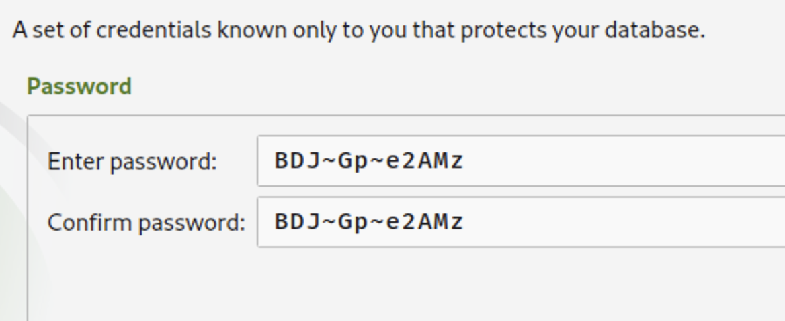
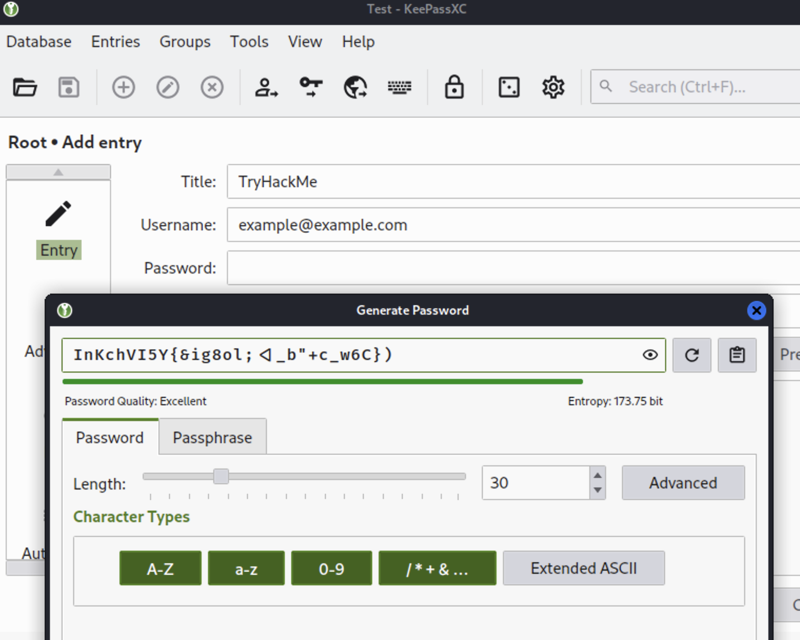

# Thursday July 14th 2022


## 📆 Today's Schedule

- **Password Cracking**: 1:30 PM - 1:55 PM (25 Minutes)
- **KeepPass Setup**: 1:55 PM - 2:30 PM (35 Minutes)
- **Break**: 2:30 PM - 2:45 PM (15 Minutes)
- **The Internet**: 2:45 PM - 3:15 PM (30 Minutes)
- **Intro To Offensive Security**: 3:15 PM - 4:00 PM (45 Minutes) 

---

## 🗝  Password Cracking

!!! examples "Exercises"

    Use hashcat to break these hashes

    **MD5** -m 0

    - f19950ca737e6420c2418b7eac5b9db4

    - 19edb333eeec9490e68a0021144ef317

    - 161229b02b1e7e220d265ab02d3dea1b

    - 1ebe9288c9210715db4c19d82d05e891

    - 958152288f2d2303ae045cffc43a02cd

    **SHA-1** -m 100

    - d2841a2cc80e25a02349261d748ef96f9de329ad

    - 335d2813013bc1ffdf1887e3d1826f1404696021

    - 1ad6e439f6875d6f25748fcf77985560625dba92

    - 7ec5ef85a4613896f47d035dd7da9b2b1bb21ba7

    - 0554de7a247b211fdd9805f0f7f200e31791a50c

---

## 🔑 KeePass Setup

!!! info "What Is KeePass?"

    KeePass is a way to manage passwords

    [KeePass Website Link](https://keepass.info/)

??? success "How It Works"

    - An encrypted file stores your password hashes (.kdb or .kdbx)

    - Decrypt the file with a master password

    - There are many KeePass clients which support the encrypted file format

??? examples "Why Use KeePass"

    - Open source - all the code is available freely and security vetted

    - You can sync your KeePass database to all your devices

    - Its free (depending on the client) 💰

    - You do not have to rely on an outside service to protect your information

??? info "Steps"

    **Install a KeePass client**

    ```
    sudo apt install keepassxc
    ```

    **Open the program**

    ```
    keepassxc
    ```

    **Create a new database**

     

    - You can keep all the default settings the same

    **Database credentials**

    Create a master password that you have never used before, and do not write
    this down.

    

    **Create A TryHackMe Password**

    

??? warning "Storing Your Database"

    - You are in charge of handling your password file

    - I recommend storing it in your google drive account or some other cloud storage

    - Make sure you remember your password - if you forget it there is no retrieving passwords

    - If you want to access your passwords on a new computer, you can download
    a client for your operating system (Windows/Mac/Linux) - there are many
    clients and they all do similar things.

---

## 🌎 The Internet

??? question "What is the Internet?"

     

??? example "IP Addresses"

    

    

    

    
    
    !!! success "See What Your Laptops IP Address Is"

??? info "Domain Name Systems"

    

    

---

## 🪖 Intro To Offensive Security

!!! abstract "Try Hack Me"
    
    Cybersecurity training platform

!!! success "Your Task"

    Complete this TryHackMe Lab: [Intro To Offensive Security](https://tryhack
    me.com/room/introtooffensivesecurity)

